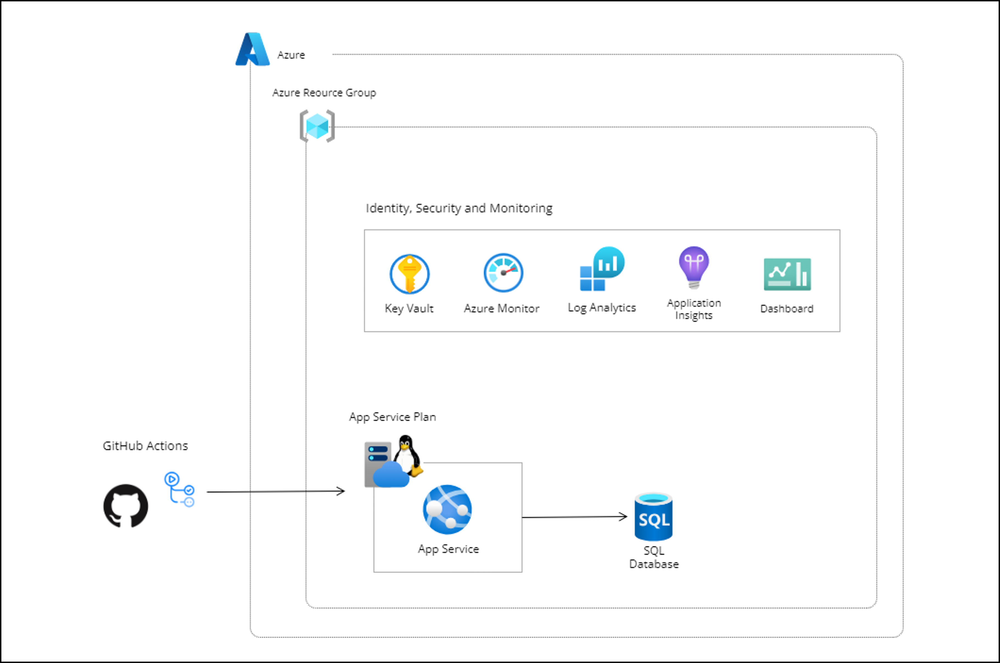

# パート 0 : 構築する環境の全体像を理解する

今回のハンズオンでは最終的に以下の環境を構築していきます。

## 構成図

## 構築する環境の概要

### App Service, SQL Database, Key Vault

サンプルの WEB アプリケーションを **App Service** にデプロイします。

**App Service** から **SQL Database** への接続文字列は **Key Vault** に保存し、セキュアな認証情報の管理を行います。

### Azure Monitor, Log Analytics, Application Insights, Dashboard

これらのリソースは、アプリケーションの監視を行うために使用します。

**Log Analytics** は、App Service のログを収集し、検索及び分析を行います。

**Application Insights** は、アプリケーションのパフォーマンスを監視します。実行時の動作や例外の発生状況、その他のメトリクスをリアルタイムで追跡、確認できます。

**Dashboard** は、監視データを一元的に表示し、視覚的に理解し易い方法でリソースの状態やパフォーマンスを可視化します。

**Azure Monitor** は、これらのリソースを包括的に管理し、クラウドリソースの監視を行います。

これらのリソースの基本的な機能と使い方を理解することで、クラウドリソースの効率的な運用管理を行うことができます。

次のパートから、実際にリソースを構築していきましょう。

---

NEXT ＞ [パート 1 : トレーニング環境を構築する](./01_setup-training-environment.md)  
TOP ＞ [トップページに戻る](/README.md)
