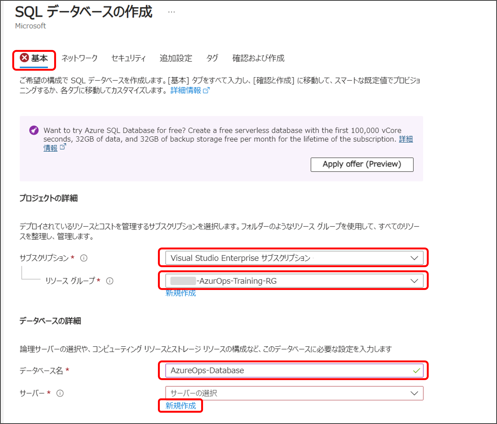
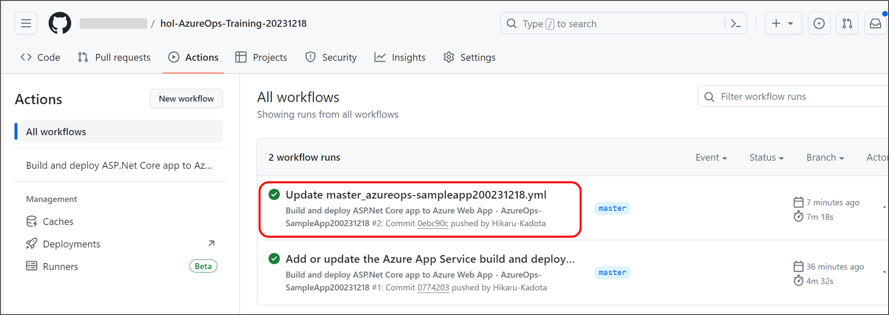
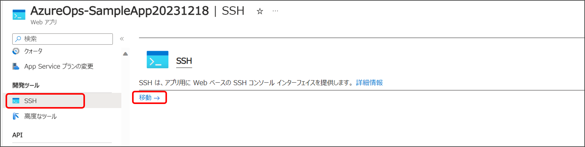

# パート１ : トレーニング環境を構築する

## パートの概要

このパートでは、ハンズオントレーニングで使用する環境を構築します。

## 環境構築

### リポジトリをフォークする

1. リポジトリの上部右側にある 「Fork」 をクリックします。
   
2. 「Owner」に自身のアカウントを選択し、「Create fork」を選択します。
   

### Azure App Service を作成する

1.  Azure Portal にログインし、自身のリソースグループに移動します。
2.  「＋作成」を選択します。  
    ※ 自身のリソースグループであることを確認してください。
    
3.  検索バーに「web app」と入力し、表示された検索結果から「Web アプリ」を選択します。
    
4.  「基本」タブを以下内容で設定します。
    ※ 入力を終えてもまだ「確認および作成」は選択しないでください。
    _ プロジェクトの詳細
    _ サブスクリプション：自身のサブスクリプション
    _ リソースグループ：自身のリソースグループ
    _ インスタンスの詳細
    _ 名前：任意の名前（ただしグローバルで一意な値）
    _ 公開：「コード」にチェック
    _ ランタイムスタック：「.NET 7（STS）」を選択
    _ オペレーティングシステム：「Linux」を選択
    _ 地域：「Japan East」を選択
    _ 価格プラン
    _ Linux プラン：「新規作成」を選択し、表示される入力欄に任意の名前を入力して「OK」を選択
    _ 価格プラン：「Basic B1」を選択

    
    

5.  「デプロイ」タブを以下内容で設定します。
    ※ 入力を終えてもまだ「確認および作成」は選択しないでください。
    _ GitHub Actions の設定
    _ 継続的デプロイ：「有効化」にチェック
    _ GitHub Actions の詳細
    _ GitHub アカウント：ご自身のアカウントを選択
    _ 組織：ご自身のアカウントを選択
    _ リポジトリ：先ほどフォークしたリポジトリを選択 \* ブランチ：「master」

    

6.  「監視」タブを以下内容で設定し「確認および作成」を選択します。  
    ※ Application Insights はパート５で有効化するため、作成時は無効にしておきます。
    _ Application Insights
    _ Application Insights を有効にする：「いいえ」にチェック

    

7.  確認画面で内容を確認し「作成」を選択します。

これで Azure App Service の作成と、サンプルアプリのデプロイを行いました。

### Azure SQL Database を作成する

1.  Azure Portal のトップページから、自身のリソースグループに移動します。
2.  「＋作成」を選択します。  
    ※ 自身のリソースグループであることを確認してください。
    
3.  検索バーに「sql database」と入力し、表示された検索結果から「SQL Database」を選択します。
    
4.  「基本」タブを以下内容で設定します。

    - プロジェクトの詳細
      - サブスクリプション：自身のサブスクリプション
      - リソースグループ：自身のリソースグループ
    - データベースの詳細
      - データベース名：任意の名前
      - サーバー：「新規作成」を選択し、ステップ 5 に進みます。

    

5.  サーバー作成画面を以下内容で設定し「OK」を選択します。
    - サーバーの詳細
      - サーバー名：任意の名前（ただしグローバルで一意な値）
      - 場所：「（Asia Pacific）Japan East」
      - 認証方法：「SQL 認証を使用する」にチェック
      - サーバー管理者ログイン：任意の値
        - パスワード：任意の値
        - パスワードの確認：パスワードと同じ値  
          ※ パスワードは後で使用しますので忘れないように控えておいて下さい。
6.  5.のステップを終えるとデータベース作成画面に戻りますので、引き続き以下内容を設定します。  
    ※ 入力を終えてもまだ「確認および作成」は選択しないでください。
    _ データベースの詳細
    _ ワークロード環境：「開発」にチェック
    _ バックアップ ストレージの冗長性
    _ バックアップ ストレージの冗長性：「ローカル冗長バックアップ ストレージ」にチェック

    

7.  「ネットワーク」タブを以下内容で設定し「確認および作成」を選択します。

    - ネットワーク接続
      - 接続方法：「パブリック エンドポイント」にチェック
    - ファイアーウォール規則
      - Azure サービスおよびリソースにこのサーバーへのアクセスを許可する：「はい」にチェック

     8. 確認画面で内容を確認し「作成」を選択します。

これで Azure SQL Database の作成が完了しました。

### App Service と Azure SQL Database を接続する

1. Azure Portal のトップページから、自身のリソースグループに移動します。
2. 作成した SQL Database に移動し、「接続文字列」にある「ADO .NET（SQL 認証）」の接続文字列をコピーします。
   
3. コピーした接続文字列の `{your_password}` の部分を、SQL Database を作成した際に設定したパスワードに置き換えます。  
   ※ ｛ ｝ も不要です。
4. 作成した App Service に移動し、「構成」にある接続文字列セクションの「＋新しい接続文字列」を選択します。
   
5. 「接続文字列の追加/編集」フィールドを以下内容で設定し「OK」を選択します。

   - 名前：`AzureOps_SampleAppContext`
   - 値：先ほどコピーして書き換えた接続文字列
   - 種類：「SQLAzure」を選択

   

6. 「保存」を選択し「続行」を選択します。
   

これで App Service と Azure SQL Database が接続されました。

### ワークフローファイルを編集する

1. ご自身のアカウントにフォークしたリポジトリを開きます。
2. 「.github/workflows」フォルダを選択します。
   
3. フォルダに含まれている .yml ファイルを選択します。
   
4. ペンマークを選択し編集モードに切り替えます。
   
5. name が「dotnet publish」となっているステップの下に以下を追記します。

   ```
   - name: dotnet install ef
     run: dotnet tool install -g dotnet-ef --version 7.0.0

   - name: dotnet bundle migrations
     run: dotnet ef migrations bundle --runtime linux-x64 -p AzureOps-SampleApp/AzureOps-SampleApp.csproj -o \${{env.DOTNET_ROOT}}/myapp/migrate
   ```

   追記後は以下のようになります。  
   行の先頭が揃っていないとエラーが表示されますので注意してください。
   

6. 「Commit changes」を選択します。
   
7. デフォルトのコミットメッセージが入力されていますので、そのまま「Commit changes」を選択します。  
   ※ これにより再度デプロイが開始されます。
   
8. しばらく待って、「Actions」タブでワークフローが終了したことを確認します。  
   ※ ワークフローの終了までには７～８分かかる場合があります。
   

### マイグレーションを実行する

1. Azure Portal のトップページから、自身のリソースグループに移動します。
2. 作成した App Service に移動し、「SSH」にある「移動 →」を選択します。
   
3. 新しいタブで SSH 接続が開始され以下の画面になるまで待機します。  
   ※ 接続が完了するまで少し時間がかかる場合があります。  
   ※ 接続に失敗した場合は、一度タブを閉じて再度「移動 →」から接続を試みて下さい。
   
4. 接続が完了したら以下のコマンドを順に実行します。

   ```
   cd /home/site/wwwroot
   ```

   

   ```
   ./migrate
   ```

   

5. App Service の「概要」にある「既定のドメイン」を選択しサンプルのアプリケーションを表示します。
   

6. 以下のような画面が表示されることを確認します。
   

## まとめ

これでハンズオントレーニングに必要な環境が構築できました。
早速、次のパートに進みましょう。

---

NEXT ＞ [パート２ : シークレットをセキュアに管理する](./02_securely-managing-secrets-with-key-vault.md)  
TOP ＞ [トップページに戻る](/README.md)
