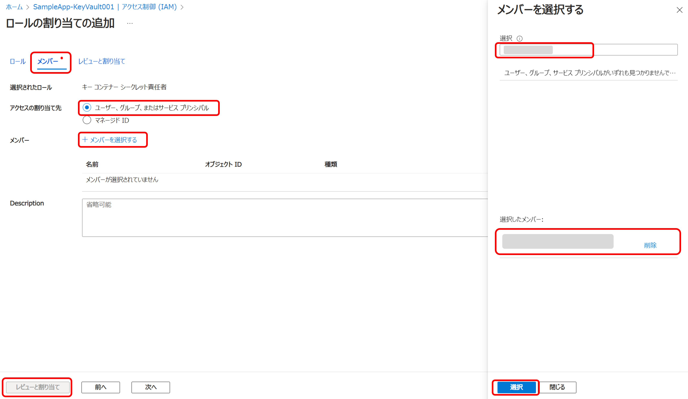

# パート２ : シークレットをセキュアに管理する

## パートの概要

このパートでは、[Azure Key Vault](https://learn.microsoft.com/ja-jp/azure/key-vault/general/overview)（以下、Key Vault） を使用してシークレットをセキュアに管理する方法を学びます。  
Key Vault では、API キー、パスワード、証明書などの機密情報を安全に保管し、[Azure ロールベースのアクセス制御 (Azure RBAC)](https://learn.microsoft.com/ja-jp/azure/role-based-access-control/overview) またはアクセス ポリシーを使用して、保管している機密情報へのアクセスを厳密に制御することができます。  
リソース固有の ID である [マネージド ID](https://learn.microsoft.com/ja-jp/entra/identity/managed-identities-azure-resources/overview) を使用することで、コードに資格情報が含まれていなくても、Key Vault への認証が可能です。  
またコンテナーのログ記録を有効にすることで、これらの機密情報に対する操作やアクセスなどのログを取得することが可能となり、セキュリティインシデントの追跡と対応を容易にすることができます。

## ケース

パート１で構築したサンプルアプリでは、Azure App Service（以下、App Service） の「構成」に接続文字列が直接保存されています。

この状態では、App Service にアクセスできる開発者であれば誰でも接続文字列を見ることができ、誤って変更されてしまう可能性もあります。  
さらに、この接続文字列へのアクセスや変更をトラッキングし、監査することは難しく、セキュリティインシデントが発生した場合に、調査や責任の追跡が困難になります。

## ハンズオン

Key Vault を使用して接続文字列を安全に保管し、その接続文字列を使用してサンプルアプリがデータベースに接続できるようにします。  
またロールベースのアクセス制御（RBAC）についても、このパートで体験していきましょう。

### Key Vault のリソースを作成する

まずは Key Vault のリソースを作成します。

1. Marketplace で 「Key Vault」を検索し、作成画面を開きます。
   
2. 「基本」タブに以下内容を入力し、「確認および作成」を選択、確認画面が表示されたら「作成」を選択します。
   _ サブスクリプション：自身のサブスクリプション
   _ リソースグループ：自身のリソースグループ
   _ Key Vault 名：任意の名前（ただしグローバルで一意な値）
   _ 地域：任意の場所
   
   

これで、使用する Key Vault リソースを作成することができました。  
次に接続文字列を Key Vault に保存したいところではありますが、 この時点ではまだ Key Vault リソースを作成したユーザー（自身）でさえも、接続文字列を Key Vault に保存することはできません。  
冒頭で Key Vault へのアクセスは厳密に制御できると紹介しましたが、接続文字列を保存するためにはシークレット責任者というロールが付与されている必要があります。
また、Key Vault に保存された接続文字列を App Service が読み取るためには、App Service にシークレットユーザーというロールが付与されている必要があります。  
そこで次はロールの設定を行います。

### ロールを設定する ⓵

Key Vault に接続文字列を保存するためのロールを設定します。

1. 作成した Key Vault に移動し「アクセス構成」の「アクセス許可モデル」で「Azure ロールベースのアクセス制御（推奨）」が選択されていることを確認します。
   

2. 「アクセス制御 (IAM)」から「＋追加」「ロールの割り当ての追加」の順に選択します
   
3. 「ロール」タブで、「キー コンテナー シークレット責任者」を選択し「次へ」を選択します
   
4. 「メンバー」タブで、「アクセスの割り当て先」に「ユーザー、グループ、またはサービス プリンシパル」が選択されていることを確認し、「＋メンバーを選択する」を選択します。  
   表示された選択画面の検索バーにメールアドレスやアカウント名を入力すると、その下に選択できるユーザーのリストが表示されるので、そこから自身を選択します。  
   すると「選択したメンバー」に自身が追加されるので、その下の「選択」、左下の「レビューと割り当て」の順に選択します。
   
5. 「レビューと割り当て」タブで、メンバーに自身が追加されていることを確認し、再度「レビューと割り当て」を選択します。
   

### ロールを設定する ⓶

App Service が Key Vault に保存した接続文字列を読み取るためのロールを設定します。

1. リソースグループから App Service に移動します。
2. App Service の「ID」を選択し、「システム割り当て済み」タブにある「状態」を オン にして「保存」を選択します。  
   
   以下のように「システム割り当てマネージド ID を有効化する」というポップアップがでたら「はい」を選択します。  
   
   この設定によりリソース固有の ID である マネージド ID が App Service に割り当てられます。

3. リソースグループから Key Vault に移動し、「アクセス制御 (IAM)」から「＋追加」「ロールの割り当ての追加」の順に選択します
   
4. 「ロール」タブで、「キー コンテナー シークレットユーザー」を選択し「次へ」を選択します。  
   ※ 【ロールを設定する ⓵】 では「キー コンテナー シークレット責任者」を選択しましたが、ここでは「キー コンテナー シークレットユーザー」を選択することに注意してください。  
   App Service には読み取りだけの最低限のロールを付与します。
   

5. 「メンバー」タブで、「アクセスの割り当て先」に「マネージド ID」を選択し、「＋メンバーを選択する」を選択します。  
   表示された選択画面の「サブスクリプション」の部分に自身のサブスクリプションを選択し、「マネージド ID」の部分に App Service を選択します。  
   表示された App Service の一覧から、ロールを割り当てる App Service を選択します。  
   すると「選択したメンバー」に App Service が追加されるので、その下の「選択」、左下の「レビューと割り当て」の順に選択します。
   
6. 「レビューと割り当て」タブで、メンバーに App Service が追加されていることを確認し、再度「レビューと割り当て」を選択します。
   

これで自身が Key Vault に接続文字列を保存できるようになり、また Key Vault に保存された接続文字列を App Service が読み込むこともできるようになりました。  
Key Vault には細かなロールが複数存在します。  
チームメンバーや各リソースに対し必要最低限のロールを与えることで、操作を制限することが可能です。  
ロールの詳細については [Key Vault データ プレーン操作のための Azure の組み込みロール](https://learn.microsoft.com/ja-jp/azure/key-vault/general/rbac-guide?tabs=azure-cli#azure-built-in-roles-for-key-vault-data-plane-operations) をご覧ください。

### Key Vault にデータベースの接続文字列を保存する

1. リソースグループから SQL データベース に移動します。
2. 「接続文字列」にある「ADO.NET (SQL 認証) 」に表示された接続文字列をコピーします。
   

   コピーした接続文字列の `{your_password}` の部分を、SQL Database を作成した際に設定したパスワードに置き換え、メモしておきます。

   ※｛ ｝ も不要です。

3. リソースグループから Key Vault に移動し、「シークレット」にある「＋生成・インポート」を選択します。
   
4. 以下を入力します。
   - 名前：任意の名前
   - シークレット値：2.でコピーした接続文字列を編集した値
5. 入力を終えたら、「作成」を選択します。
   
6. 作成したシークレットから「現在のバージョン」を選択し、表示された「シークレット識別子」をコピーします。
   
   
   
7. リソースグループから App Service に移動し、「構成」の接続文字列フィールドにある「AzureOps_SampleAppContext」の編集ボタンを選択します。
   
8. 接続文字列の「値」に、6.でコピーしたシークレット識別子を以下の通り編集して貼り付けます。  
   `@Microsoft.KeyVault(SecretUri={コピーしたシークレット識別子})`

   ※例 `@Microsoft.KeyVault(SecretUri=https://******\*******)`

   これは アプリケーションが [キーコンテナーを参照するための構文](https://learn.microsoft.com/ja-jp/azure/app-service/app-service-key-vault-references?tabs=azure-cli#source-app-settings-from-key-vault) です。  
   貼り付けが終わったら、「OK」を選択します。
   

9. 「保存」を選択し、変更を保存します。  
   

### アプリケーションがデータベースにアクセスできることを確認する

実際にアプリケーションにアクセスして、データベースに接続できているか確認します。

1. リソースグループから App Service に移動します。
2. 「概要」にある「既定のドメイン」の URL を選択しアプリケーションを表示します。
   
3. データベースに正常に接続できていれば、以下の様な画面が表示されます。  
   「Create New」ボタンからデータを登録するなどして、データがの読み書きが正常に処理されることを確認します。
   
   
   

## まとめ

ここまでの手順により、接続文字列のような機密情報を Key Vault で安全に管理することができるようになりました。  
ハンズオンでは、このシークレットを登録する作業のため自身にシークレット責任者のロールを付与しましたが、このロールを外すとシークレットを見る・編集する・削除するといった操作はできなくなります。  
開発や運用においては、チームメンバーそれぞれに必要最低限のロールを付与することで、シークレットの管理や誤操作によるトラブルなどを意識することなく自身の作業に専念することができます。  
またセキュリティインシデントが発生した場合にも、Key Vault のログを確認することで、迅速且つ適格な対応が可能となります。  
ログの取得については、[パート４ : Azure Monitor Logs を使用してログを収集する](./04_collecting-logs-with-azure-monitor-logs.md) でご紹介します。

---

NEXT ＞ [パート３ : アプリケーションの正常性チェックを設定する](./03_ensuring-application-health-with-health-checks.md)  
TOP ＞ [トップページに戻る](/README.md)
