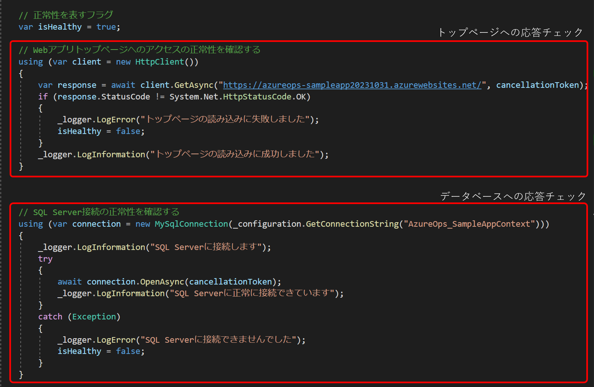
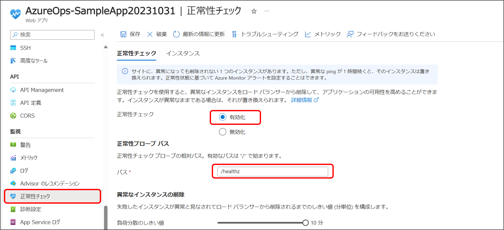
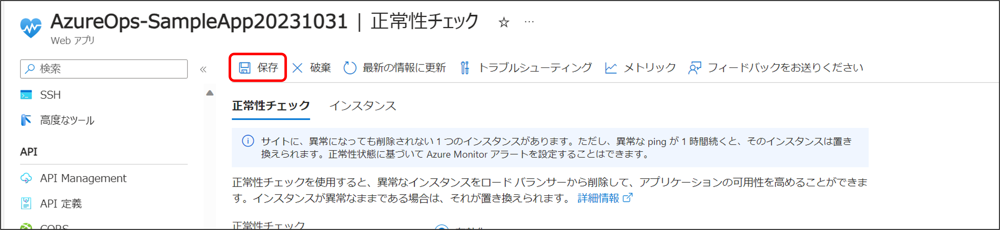
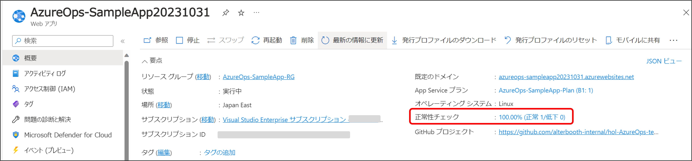
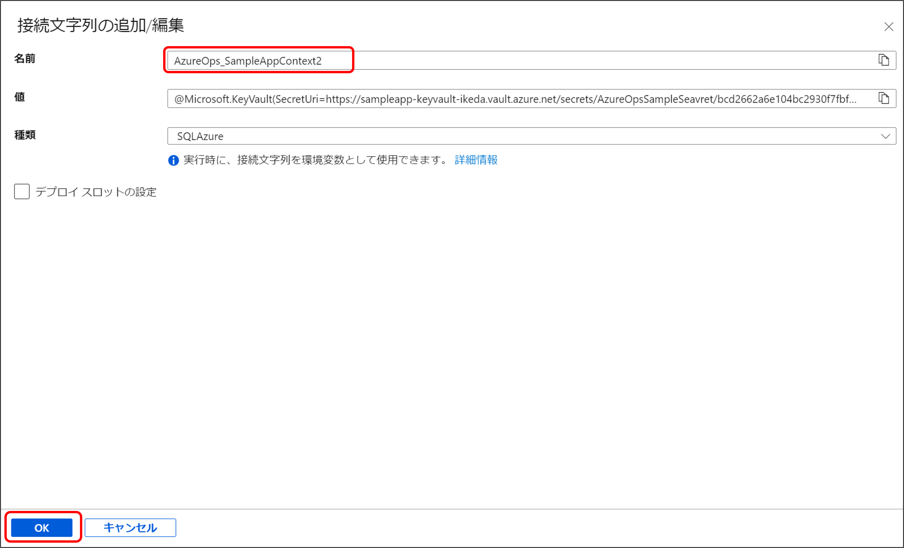
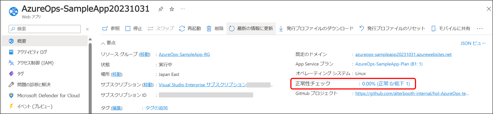
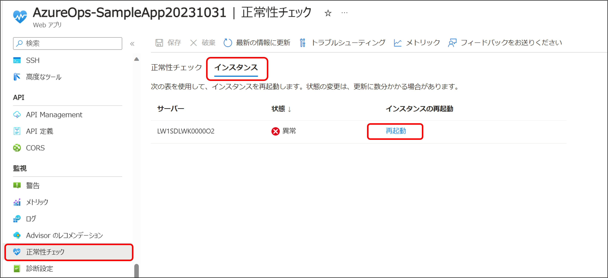

# パート３ : アプリケーションの正常性をチェックする

## パートの概要

このパートでは、App Service の正常性チェックという機能を使用して、アプリケーションが正常に動作しているかどうかを定期的に確認し、必要に応じて対処できるようにするための仕組みについて理解します。  
これは、アプリケーションの可用性を確保し、障害が発生した場合に早期に対応するために非常に重要な手段です。  
また正常性チェックでは、異常なインスタンスが見つかった場合に要求を再ルーティングし、正常に戻らないインスタンスを置き換えることができるので、アプリケーションの可用性が向上します。  
アプリケーションが正常に動作しているかどうかを確認するためには、任意のエンドポイントに対して HTTP リクエストを定期的に行います。  
サンプルアプリには事前に、`/healthz` というエンドポイントを設けており、そこに HTTP リクエストが送られると App Service 及び データベースとの疎通チェックを行った結果が返るミドルウェアを構成しています。

## ケース

App Service の正常性チェックを有効にし、アプリケーション（App Service やデータベース）が正常に稼働している場合とそうでない場合の違いを確認します。

## ハンズオン

### 正常性チェックの仕組みを理解する

ソースコードに予め用意している正常性プローブの内容を確認します。  
ここではコードの中身を理解する必要はありませんが、どの様な仕組みで正常性をチェックしているのかを確認しましょう。  
まず、プロジェクトフォルダには `SampleHealthCheck.cs` というファイルがあります。  
このファイルでは、アプリケーションのトップページに HTTP リクエストを送り、その結果を取得する処理と、MySQL データベースに対し接続を試みた結果を取得する処理の２つが記述されています。  
いずれも問題なければ結果として Healthy を、どちらか一方でも問題があれば Unhealthy を返します。  
【SampleHealthCheck.cs】  

App Service の正常性チェックは、このエンドポイントとなる `/healthz` に 1 分置きに ping を行い、その結果を取得します。  
複数回、もしくは数時間要求しても正常な応答を得られない場合、そのインスタンスは異常と判断され、自動的に新しいインスタンスに置き換えられることでアプリケーションの可用性が向上します。  
より詳しい内容については [App Service で正常性チェックを使用した処理](https://learn.microsoft.com/ja-jp/azure/app-service/monitor-instances-health-check?tabs=dotnet#what-app-service-does-with-health-checks) をご覧下さい。

### 正常性チェックを有効にする

1. リソースグループから App Service に移動します。
2. 「正常性チェック」にある「正常性チェック」の項目で「有効化」を選択し、「正常性プローブパス」にエンドポイントである `/healthz` を入力します。
   
3. 入力を終えたら「保存」を選択します。
   

### 正常性を確認する

正常性チェックを有効にすると、App Service の概要にある「正常性チェック」にインスタンスの状態が表示されます。  
トレーニングではインスタンスを１台にしていますので、その１台が正常であれば 100% と表示され、異常と判断された場合は 0.00% と表示されます。  

その隣に括弧で表示されているのは、正常なインスタンスの台数と、異常もしくは正常性チェックがまだ実行されていないインスタンスの台数が低下として表示されています。  
実際の運用ではスケールアウトして複数台のインスタンスを使用することが多く、正常なインスタンスの割合に応じてこの数値は変動します。

では、異常である場合を再現するために SQL データベースへの接続でエラーを発生させてみましょう。

「構成」→「接続文字列」から、「接続文字列」の「名前」を変更して「OK」を選択します。

※ 名前は何でも構いませんが、今回は「AzureOps_SampleAppContext」を「AzureOps_SampleAppContext2」に変更します。

変更が完了したら、「保存」を選択します。

正常性チェックの結果が反映するには少し時間がかかります。
また、キャッシュの影響により正常性チェックは終わっていても単に画面に反映していないだけの場合もあるため、以下の操作で何度かリロードしてみてください。

- Windows：Ctrl + Shift + R
- Mac：Command + Shift + R

結果が反映すると、以下の様に正常性チェックが 0.00% となっていることが確認できます。  
データベースとの接続が失敗しているため、正常性チェックに失敗したインスタンスがあると判断されています。

異常と判断されているインスタンスは「正常性チェック」にある「インスタンス」タブで確認することができ、そこから対象のインスタンスを再起動することも可能です。  
今回は意図的にデータベースを停止させているので、インスタンスを再起動しても正常性チェックは失敗しますが、通常の運用ではこの再起動を行うことでインスタンスが正常に戻ることもあります。

ここまでの作業が完了したら、先ほど変更した SQL データベースへの接続文字列名を元に戻しておきましょう。

## まとめ

このパートでは、App Service の正常性チェックを有効にし、アプリケーション（App Service やデータベース）が正常に稼働している場合とそうでない場合の違いを確認しました。  
異常なインスタンスが一定時間正常に戻らない場合には、自動的に新しいインスタンスに置き換えられることでアプリケーションの可用性が向上します。  
この正常性チェックは、アプリケーションの可用性を確保し、障害が発生した場合に早期に対応するために非常に重要な手段です。

---

NEXT ＞ [パート４ : Azure Monitor ログ を使用してログを収集する](./04_collecting-logs-with-azure-monitor-logs.md)  
TOP ＞ [トップページに戻る](/README.md)
