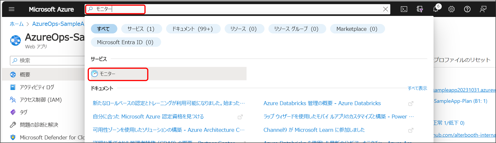

# パート４ : Azure Monitor ログ を使用してログを収集する

## パートの概要

このパートでは、[Azure Monitor ログ](https://learn.microsoft.com/ja-jp/azure/azure-monitor/logs/data-platform-logs) を使用してアプリケーションのログを収集する方法を学習します。  
Azure Monitor ログ は、[Azure Monitor](https://learn.microsoft.com/ja-jp/azure/azure-monitor/overview) の機能の一つで、監視対象のリソースからログとパフォーマンス データを収集して整理する機能です。

Azure Monitor ログ には、クラウドおよびハイブリッドアプリケーションとそのサポートコンポーネントの、パフォーマンスや可用性を監視するために役立つさまざまなデータが表示されます。  
監視対象となるリソースから収集されたログを [Log Analytics ワークスペース](https://learn.microsoft.com/ja-jp/azure/azure-monitor/logs/log-analytics-workspace-overview) に保存し、Azure Monitor ログ で [KQL](https://learn.microsoft.com/ja-jp/azure/data-explorer/kusto/query/) と呼ばれるクエリを実行することで、強力な分析エンジンを使用してログデータを対話形式で分析することができます。  
またログの保存場所として Azure Storage や Event Hub などを指定することもできますが、KQLを使用した高度な分析を行う場合には Log Analytics ワークスペース に保存します。


## ケース
ログの収集に必要となる診断設定を作成し、App Service のログを Log Analytics ワークスペース に保存します。  
その後アプリケーションで意図的にサーバーエラーを発生させ、Azure Monitor ログ を使用してログを分析することで問題の場所を特定します。

## ハンズオン

### ログデータを格納する Log Analytics ワークスペース を作成する

1. Marketplace で「ログ」と検索し、表示されたリソースから「ログ分析（OMS）」を選択し作成画面を開きます。

2. 「基本」タブに以下内容を入力し、「確認および作成」を選択、確認画面が表示されたら「作成」を選択します。
    * サブスクリプション：自身のサブスクリプション
    * リソースグループ：自身のリソースグループ
    * 名前：任意の名前（ただしグローバルで一意な値）
    * 地域：任意の場所


これで、使用する Log Analytics ワークスペース が作成されました。  
次は監視対象のリソースからログを収集するための診断設定を作成します。

### 診断設定の作成

1. リソースグループから App Service に移動します。
2. 「診断設定」にある「診断設定を追加する」を選択します。
   
3. 以下内容を入力し「保存」を選択します。
    * 診断設定の名前：任意の名前
    * ログ・メトリック：全てにチェック
    * 宛先の詳細：「Log Analytics ワークスペースへの送信」にチェック
      * サブスクリプション：自身のサブスクリプション
      * Log Analytics ワークスペース：先ほど作成した Log Analytics ワークスペース

ログ・メトリックの全ての項目にチェックを入れましたが、これは Log Analytics ワークスペース に保存したいログの種類を指定します。  
今回は全てのログを保存するようにしていますが、実際の運用では必要なログのみを保存するように設定します。

これで App Service のリソースから ログを保存する設定が完了しました。  
この後のステップでは、まずサンプルのアプリケーションで意図的にエラーを発生させます。  
そして、Azure Monitor ログ を使用してエラーが発生している場所を特定します。

### アプリケーションでサーバーエラーを発生させる

サンプルのアプリケーションには予め意図的に例外を発生させるリンクを設置しており、そのリンクをクリックすることでサーバーエラー（500 Internal Server Error）を発生させます。  

1. リソースグループから App Service に移動します。
2. 「概要」にある「既定のドメイン」のURLをクリックしサンプルのアプリケーションを開きます。

※ この時「パート３ : アプリケーションの正常性をチェックする」で SQLデータベースへの接続エラーが出たままの状態だと別のエラーが発生してしまいます。その場合は、SQLデータベースへの接続でエラーが出ない状態にしてから再度アプリケーションを開いてください。
3. アプリケーションの画面が表示されたら、画面上部の「サーバーエラー発生」をクリックします。

すると以下のようなエラー画面となることが確認できます。


### Azure Monitor を使用する
冒頭でも説明しましたが、Azure Monitor ログ は Azure Monitor の機能の一つです。  
Azure Monitor はリソースとして作成する必要はなく、Azure Portal のどこからでもアクセスすることができます。

1. Azure Portal の最上部にある検索バーで「モニター」と検索し、表示されたサービスから「モニター」を選択します。

2. 「概要」にある「ログ」を選択します。

最初に表示されるクエリ選択画面は「×」で閉じて下さい。

3. Azure Monitor ログが表示されたら「スコープの選択」を選択します。

4. 「範囲の選択」で先ほど作成した Log Analytics ワークスペース にチェックを入れ、「適用」を選択します。

※ [スコープ](https://learn.microsoft.com/ja-jp/azure/azure-monitor/logs/scope) はログを分析する対象のリソースを指定します。  
MySQLデータベースやその他リソースのログをこの Log Analytics ワークスペース に集約することで、包括的なログ分析が可能となります。  
また、今回使用している App Service のリソースをスコープとして選択した場合でも同じログを確認することができますが、その場合その他のリソースのログは分析の対象外となります。

### AppServiceHTTPLogs を確認する

AppServiceHTTPLogs とは、App Service でホストされる Web アプリの HTTP リクエストのログです。  
これらのログは、`AppServiceHTTPLogs` テーブルに保存されています。

1. クエリウィンドウに以下のクエリ（KQL）を入力し、「実行」を選択します。  
このクエリは、AppServiceHTTPLogs から HTTP ステータスコードが 500 のログのみを取得します。
    ```
    AppServiceHTTPLogs
    | where ScStatus == 500
    ```
    

2. クエリの実行結を確認します。  
結果ウィンドウの最左には、ログが出力された時間（サーバーエラーを発生させた時間）が表示されています。  
また結果ウィンドウを右にスクロールすると、`ScStatus`（HTTP ステータスコード）列が 500 となっていることが確認できます。

時間範囲を指定したり、国に合わせた時刻で表示するように設定することも可能です。

### AppServiceConsoleLogs を確認する

HTTP 500 を確認できたので、次はアプリの標準出力とエラーを見てみましょう。  
これらのログは、`AppServiceConsoleLogs` テーブルに保存されています。

1. クエリウィンドウに以下のクエリ（KQL）を入力し、「実行」を選択します。  
このクエリは、AppServiceConsoleLogs の全てのログを取得します。
    ```
    AppServiceConsoleLogs
    ```
    

2. クエリの実行結を確認します。  
アプリケーションの標準出力が `ResultDescription` 列から確認できます。

※ これらのログは「パート３ : アプリケーションの正常性をチェックする」で正常性チェックを有効にした結果、出力されているログになります。  
結果画面を下にスクロールすると、同じログが１分置きに出力されていることが確認できます。  
これにより正常性チェックが正しく動作していることが確認できます。

### AppServiceHTTPLogs と AppServiceConsoleLogs を結合する

前のステップでは、HTTP 500 と 標準出力をそれぞれ別のテーブルに対するクエリで確認しました。  
ここでは、HTTP 500 エラーと同時に出力された標準出力のログを確認して、エラーの原因を確認します。

1. クエリウィンドウに以下のクエリ（KQL）を入力し、「実行」を選択します。  
このクエリは、`AppServiceHTTPLogs` と `AppServiceConsoleLogs` のテーブルを `TimeGenerated` 列をキーにして結合し、HTTP 500 の発生と同時刻の標準出力の内容を確認します。
    ```
    let myHttp = AppServiceHTTPLogs
    | where  ScStatus == 500 | project CsUriStem, ScStatus, TimeGen=substring(TimeGenerated, 0, 19);
    let myConsole = AppServiceConsoleLogs
    | project ResultDescription, TimeGen=substring(TimeGenerated, 0, 19);
    myHttp
    | join kind=inner myConsole on TimeGen | project TimeGen, CsUriStem, ScStatus, ResultDescription;
    ```
	
2. クエリの実行結を確認します。  
HTTP 500 エラーのログに標準出力の `ResultDescription` 列が結合されています。

赤枠で囲ったログの `ResultDescription` 列を確認すると、以下のようにエラーが発生している場所が記載されています。そして実際にサンプルのアプリケーションのソースコードには、`ServerError.cshtml.cs` の 19 行目に例外を発生させるコードを記述しています。
    ```
    at AzureOps_SampleApp.Pages.ServerError.OnGet() in /home/runner/work/hol-AzureOps-template/hol-AzureOps-template/AzureOps-SampleApp/Pages/ServerError.cshtml.cs:line 19
    ```

## まとめ
このハンズオンでは、Azure Monitor ログを使用してアプリケーションのログを収集し、エラーが発生した場所を特定する手順を学びました。  
このようなログの収集と分析を通じて、アプリケーションの健全性やパフォーマンスに関する情報を把握し、問題が発生した場合には素早く対応できるようになります。  
Azure Monitor ログ を利用することで、クラウドアプリケーションの監視とトラブルシューティングをより効果的に行うことができます。

次のパートでは、Application Insights を使用してアプリケーションの監視を行います。

---
NEXT ＞ [パート５ : Application Insights を使用してアプリケーションを監視する](./05_monitoring-applications-with-application-insights.md)  
TOP ＞ [トップページに戻る](/README.md)
