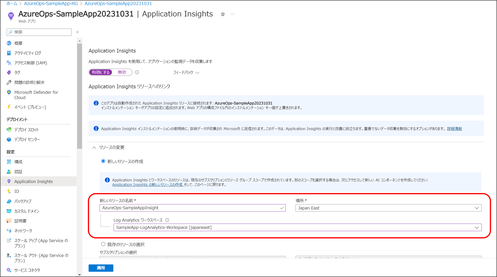
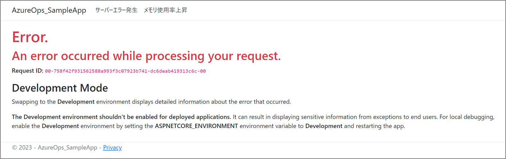

# パート５ : Application Insights を使用してアプリケーションを監視する

## パートの概要

このパートでは、Application Insights を使用してアプリケーション全体の構成要素を監視します。

## アプリケーションインサイトとは

Application Insights は、Azure Monitor の機能の 1 つで、
クラウドアプリケーション全体のパフォーマンスを管理するためのツールです。

Application Insights には数多くの機能が提供されており、以下はその代表的な機能です。

### 調査

- アプリケーションマップ
  - アプリケーションのリソース間の関係性と相互作用を視覚的に確認。
- 可用性ビュー
  - アプリケーションエンドポイントの可用性と応答を事前に監視してテストします。
- アプリケーションダッシュボード
  - アプリケーションの正常性とパフォーマンスを確認。
- ライブメトリック
  - アプリケーションのアクティビティとパフォーマンスに対する分析情報のリアルタイムな分析ダッシュボード。
- トランザクションの検索
  - トランザクションを追跡および診断して、問題を特定し、パフォーマンスを最適化します。
- パフォーマンス ビュー
  - アプリケーション パフォーマンス メトリックと潜在的なボトルネックを確認します。
- エラー ビュー
  - アプリケーション内のエラーを特定および分析して、ダウンタイムを最小限に抑えます。

### 監視

- アラート
  - アプリケーションの幅広い側面を監視して、さまざまなアクションをトリガーします。
- メトリック
  - メトリックデータを詳しく確認して、使用状況のパターンと傾向を把握します。
- 診断設定
  - 選択したエクスポート先へのプラットフォーム ログとメトリックのエクスポートのストリーミングを構成します。
- ログ
  - Azure の監視ログに収集されているすべてのデータを取得、統合、分析します。
- ワークブック
  - アプリケーションの監視データを視覚化する対話型のレポートとダッシュボードを作成します。

## ケース

Application Insights の機能であるアプリケーションマップを使用し、
アプリケーションのリソース間の関係性と相互作用を視覚的に確認します。

擬似的にエラーを発生させ、アプリケーションマップからどのようにエラー内容を特定するかを確認します。

## ハンズオン

### Application Insights を有効化する

1. リソースグループから App Service に移動します。
2. 「設定」 にある 「Application Insights」 を選択します。
3. 「Application Insights を有効にする」を選択します。
   

4. 「新規リソースの作成」から前の章で作成した Log Analytics ワークスペース を選択します。
   

5. 適応をクリックします。※アプリケーションの再起動を促されますので、そのまま[はい]を選択します。
   

6. 設定が完了した事を確認します。
   

### Application Insights からアプリケーションマップ確認する

1. ポータル画面の検索窓から[モニター]を検索します。
2. Azure Portal の最上部にある検索バーで「モニター」と検索し、表示されたサービスから「モニター」を選択します。
   

3. 「Application Insights」「表示」を選択し、先程作成したリソースをクリックします。
   

4. アプリケーションインサイトの画面から「調査」の「アプリケーションマップ」を選択します。

5. アプリケーションマップにアプリケーションの依存関係が表示されます。※もし下記の図のように SQL Database が表示されない場合は、サンプルアプリでデータの追加や削除を行い、何回かリロードを行ってください。
   

### アプリケーションマップの構成要素

画面には丸で囲まれた部分が 2 つあります。
これらは「ノード」と呼びます。
そして緑丸で囲まれている部分は「コンポーネント」と呼ばれ、Application Insights の SDK が組み込まれているアプリケーションそのものです。コンポーネントであるサンプルアプリから SQL データベース を呼び出している事が視覚的に把握できます。

## アプリケーションマップからアプリケーションの正常性とパフォーマンスを確認する

ここでは、アプリケーションマップを使用してどのようにトラブルシュートを行うかを確認します。
まず、SQL Database への接続を切断しアプリケーションマップにどのような影響があるかを確認します。

1. リソースグループから「キーコンテナー」に移動します。
   

2. 「シークレット」→「作成したシークレット名」→「新しいバージョン」を選択します。

3. シークレット値に間違った SQL Database の接続文字列を入力します。
   `tcp:<DB名>.database.windows.net`を`tcp:<DB名>.database.windows`に変更してみましょう。

```diff
#変更前(例)
Server=tcp:azureops-db-server.database.windows.net,1433;Initial Catalog=AzureOps-Database;Persist Security Info=False;User ID=sampleuser;Password=Password12345;MultipleActiveResultSets=False;Encrypt=True;TrustServerCertificate=False;Connection Timeout=30;


#変更後(例)                                     ↓ .net を削除
Server=tcp:azureops-db-server.database.windows,1433;Initial Catalog=AzureOps-Database;Persist Security Info=False;User ID=sampleuser;Password=assword12345;MultipleActiveResultSets=False;Encrypt=True;TrustServerCertificate=False;Connection Timeout=30;
```

4. バージョンが更新されるので、新たなシークレット識別子をコピーします。
   

5. リソースグループから App Service に移動し、「設定」→「構成」から接続文字列の値を先程コピーしたシークレット識別子に変更し、保存します。

6. リソースグループから App Service に移動し、アプリケーションを再起動します。
   ※再起動には少し時間がかかります。
   

7. アプリケーションへアクセスし、エラーが発生している事を確認します。
   

8. 「モニター」→「Application Insights」→「アプリケーションマップ」へ移動します。
9. 「コンポーネント」でエラーが発生している事が確認できます。コンポーネントをクリックし、詳細を表示します。
   「上位の失敗した要求」で複数のエンドポイントでエラーが発生している事が確認できます。詳細を確認する為、「エラーの調査」を選択します。

   ※アプリケーションマップにエラーが表示されていない場合は、何度か「最新の情報に更新」ボタンを押すか画面をリロードしてください。
   

10. 「上位 3 応答コード」では 404、503、500 が発生しています。500 の箇所をクリックし「提案」されているサンプルを確認してみましょう。
    

11. `EXCEPTION`の詳細情報を確認する事ができます。
    

ここでは`GET`で`/index`へリクエストした際に`azureops-db-server.database.windows`という存在しないインスタンスへ接続しようとし、失敗している事が確認できます。
`EXEPTION`の`Message`では以下の内容が表示されています。

```
A network-related or instance-specific error occurred while establishing a connection to SQL Server. The server was not found or was not accessible. Verify that the instance name is correct and that SQL Server is configured to allow remote connections. (provider: TCP Provider, error: 35 - An internal exception was caught) Name or service not known

SQL Server への接続の確立中に、ネットワーク関連またはインスタンス固有のエラーが発生しました。

サーバーが見つからないか、アクセスできませんでした。インスタンス名が正しい事。
SQL Server がリモート接続を許可するように構成されている事。を確認してください。
```

SQL データベース のインスタンス名が間違っている事が示唆されています。

このように、Application Insights のアプリケーションマップを使用する事で、アプリケーションのエラーを効率的に調査する事ができました。

### 元の状態に戻す

最後に正しいバージョン時のシークレット識別子に戻しておきます。

1. リソースグループから「キーコンテナー」へ移動し、「シークレット」→「作成したシークレット名」→「以前のバージョン」を選択し、「シークレット識別子」をコピーします。
2. リソースグループから App Service に移動し、「設定」→「構成」から接続文字列の値を先程コピーしたシークレット識別子に変更し、保存します。
3. アプリケーションを再起動します。
4. アプリケーションへアクセスし、正常に動作している事を確認します。

---

次のパートでは、Azure Monitor のアラート機能を使用して、アプリケーションの異常を通知する方法を確認します。

NEXT ＞ [パート６ : アラートを使用してメトリックの異常を通知する](./06_detecting-application-issues-with-alerts.md)  
TOP ＞ [トップページに戻る](/README.md)
