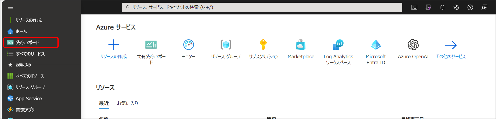
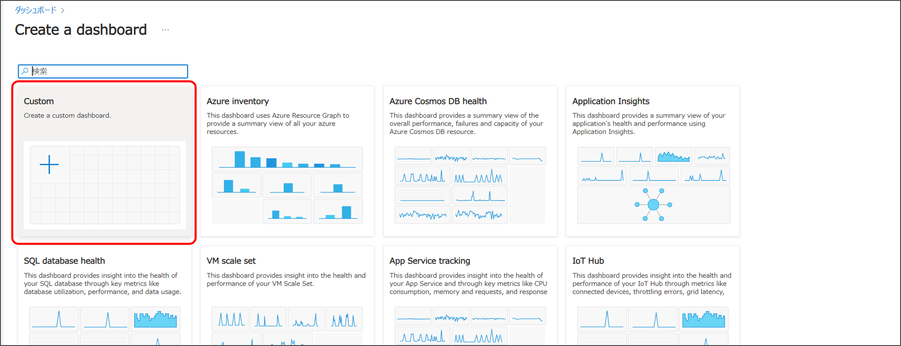
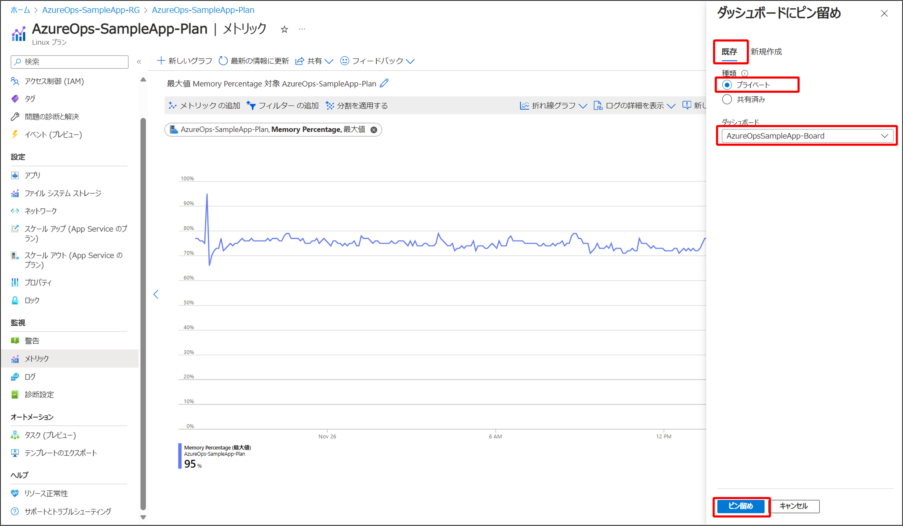

# パート７ : ダッシュボードを使った効率的なモニタリング

## パートの概要

このパートでは、[Azure Monitor](https://learn.microsoft.com/ja-jp/azure/azure-monitor/overview) の機能の一つである [Azure ダッシュボード](https://learn.microsoft.com/ja-jp/azure/azure-monitor/visualize/tutorial-logs-dashboards) を使った効率的なモニタリングについて学びます。
パート４やパート６で学習したモニタリングの知識をダッシュボードを使って効率的にモニタリングする方法を学びます。
ダッシュボードを使用することで、複数のリソースログやメトリックの情報を一つの画面で確認することができます。

## ケース

以下の様なダッシュボードを作成します。


## ハンズオン

### ダッシュボードのフォーマットを作成する

1. Azure Portal の最上部左側にあるハンバーガーメニューを開き「ダッシュボード」を選択します。  
   
2. 「＋作成」を選択します。
   
3. 「Custom」を選択します。
   
4. 任意のダッシュボード名を入力します。  
   （まだ「保存」を押さないように注意してください）
   
5. 「＋タイルの追加」を選択し、表示されたタイルギャラリーから「マークダウン」を選択し「追加」を選択します。
   
6. マークダウンの編集ウィンドウで以下内容を入力し「完了」を選択します。
   _ タイトル：削除（何も入力されていない状態にします）
   _ サブタイトル：削除（何も入力されていない状態にします） \* インライン編集ウィンドウ：「# App Service」
   
7. 作成したタイルの右下をドラッグし、縦１マス × 横４マスのサイズに縮小します。
   
8. 同じ手順で「# SQL Database」というタイルを作成し、App Service のタイルの横に配置し「保存」を選択します。
   

### ダッシュボードにメトリックを表示する

1. リソースグループから App Service Plan に移動します。
2. 「メトリック」を選択し、「メトリック」と「集計」を以下の様に設定します。
   _ メトリック：Memory Percentage
   _ 集計：最大値
   
   【補足】
   パート４やパート６では、Azure Monitor の画面からログやメトリックを確認しましたが、各リソースのメニューからも同じ内容を確認することができます。
   この場合、そのリソースが予めスコープとして設定された状態となります。
3. 「ダッシュボードに保存」を選択し「ダッシュボードにピン留め」を選択します。
   
4. 「既存」タブで以下の通り設定し「ピン留め」を選択します。
   _ 種類：「プライベート」にチェック
   _ ダッシュボード：作成したダッシュボード
   

### ダッシュボードにログを表示する

1. リソースグループから App Service に移動します。
2. 「ログ」を選択し、クエリウィンドウに以下のクエリを入力します。
   ```
   AppServiceHTTPLogs
   | where ScStatus == 500
   | summarize ErrorCount = count() by bin(TimeGenerated, 1h)
   ```
   
3. 結果が表示されたら「グラフ」タブを選択し、「ピン留め先」から「Azure ダッシュボード」を選択します。
   
4. 「既存」タブで以下の通り設定し「ピン留め」を選択します。
   _ 種類：「プライベート」にチェック
   _ ダッシュボード：作成したダッシュボード
   

### ダッシュボードのレイアウトを修正する

1. Azure Portal の最上部左側にあるハンバーガーメニューを開き「ダッシュボード」を選択します。  
   
2. 作成したダッシュボードを選択して表示します。  
   （既に表示されている場合この手順は不要です）
   
3. 「編集」を選択します。
   
4. 各タイルのサイズを調整し、配置をドラッグ＆ドロップで調整し見た目を整えたら「保存」を選択します。
   

以下のようなレイアウトになっていれば完了です。

レイアウトは自由に変更することができます。  
効率よく監視できるようにレイアウトを工夫することが大切です。

時間に余裕がある場合は、SQL Database からログやメトリックをダッシュボードに追加してみてください。

## まとめ

このセクションでは、Azure Monitor の重要な機能である Azure ダッシュボード を使って、モニタリングをより効率的に行う方法を学びました。  
ログやメトリックを取得し、必要な情報をダッシュボードに追加することで、監視対象となる複数のリソースにおいてログやメトリックを一つ一つ確認することなく効率的に監視することができます。  
また、ダッシュボードの柔軟性を利用して、自身や監視チームのモニタリングニーズに合わせた設定やレイアウトの変更を行うことが重要です。  
これにより、Azure Monitor の ダッシュボード を通じてリアルタイムでのトラブルシューティングや、システムのパフォーマンス評価が容易になり、クラウドリソースの最適化と円滑な運用が可能になりました。

＞ [TOP](/README.md)
